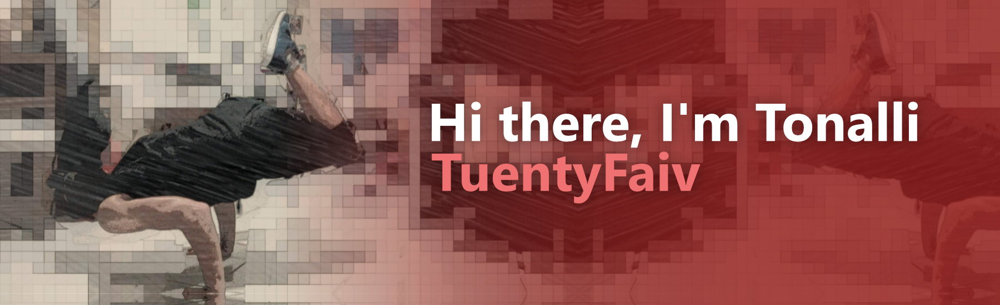

 
 
**Frontend developer** focused on creating good interfaces and giving the best user experience. Constantly updating me on technologies like Javascript, React, Sass, GraphQL and more. Also learning and improving on UI, UX and basic design fundamentals to improve my quality as Frontend

  
  
  

<h2 align="center">🧠 My knowledges</h2>

  
  
  
  
  
  
  
  
  
  
  
  
  
  
  
  

<h2 align="center">🏗 My Projects</h2>

### **[🎬 Mediaplayer](https://www.npmjs.com/package/@tuentyfaiv/mediaplayer)**
> This is a media player built with web components, typescript and sass, to work in any javascript framework or library.
> 
> [Repository here](https://github.com/TuentyFaiv/Mediaplayer)

### **[💻 Portfolio](https://tuentyfaiv.vercel.app/)**
> Website where I show the projects that I have done and participated in, and sometimes I write publications or "tutorials" on web development.
> 
> [Repository here](https://github.com/TuentyFaiv/website)

### **[🐦 Colibrí Landing page](https://colibri.education/)**
> A landing page of a children's stay and children's garden with basic information to show what they know how to do, made in Gatsby.js and with formspark for the contact form.
> 
> _Repository not available_

### **[🧪 Rick and Morty](https://rickandmorty.tuentyfaiv.vercel.app/)**
> Website showing Rick and Morty's characters, locations and episodes, using [GraphQL's Rick and Morty API](https://rickandmortyapi.com/). You can filter the information.
> 
> [Repository here](https://github.com/TuentyFaiv/Rick-and-Morty)

### **[🎨 Simon say game](https://tuentyfaiv.github.io/JuegoSimon/)**
> The classic game of following the patron saint of colors, project resulting from the course of JavaScript Basics of Platzi. Levels and speeds can be configured.
> 
> [Repository here](https://github.com/TuentyFaiv/JuegoSimon)

### **[🎧 App podcast](https://podcast.tuentyfaiv.vercel.app/)**
> Podcast application made in Next.js using the [AudioBoom API](https://api.audioboom.com/channels/recommended/), with this application I learned how to use Next.js.
> 
> [Repository here](https://github.com/TuentyFaiv/AppPodcast)

### **[⚔ X Perience](https://xperience.vercel.app/)**
> This is a personal project that I'm still building, done in React, Redux, Sass. My goal is to be able to generate projects from various areas of study so that students gain experience and have less difficulty getting a job.
> 
> [Repository here](https://github.com/TuentyFaiv/giveMeExperience)
