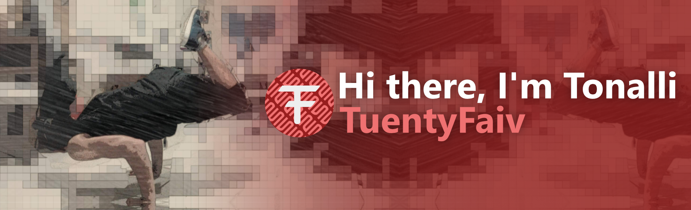

<!--About Me-->
<!--Contact Info-->

<h2 align="center">Technologies</h2>
<!--Logos with names-->
<!--Or Images with logoa and names-->

<h2 align="center">🏗 My Projects</h2>

### **[🎬 Mediaplayer](https://www.npmjs.com/package/@tuentyfaiv/mediaplayer)**
> This is a media player built with web components, typescript and sass, to work in any javascript framework or library.
> 
> [Repository here](https://github.com/TuentyFaiv/Mediaplayer)

### **[💻 Portfolio](https://tuentyfaiv.vercel.app/)**
> Website where I show the projects that I have done and participated in, and sometimes I write publications or "tutorials" on web development.
> 
> [Repository here](https://github.com/TuentyFaiv/website)

### **[🐦 Colibrí Landing page](https://colibri.education/)**
> description
> 
> _Repository not available_

### **[🧪 Rick and Morty](https://rickandmorty.tuentyfaiv.vercel.app/)**
> Website showing Rick and Morty's characters, locations and episodes, using [GraphQL's Rick and Morty API](https://rickandmortyapi.com/). You can filter the information.
> 
> [Repository here](https://github.com/TuentyFaiv/Rick-and-Morty)

### **[🎨 Simon say game](https://tuentyfaiv.github.io/JuegoSimon/)**
> The classic game of following the patron saint of colors, project resulting from the course of JavaScript Basics of Platzi. Levels and speeds can be configured.
> 
> [Repository here](https://github.com/TuentyFaiv/JuegoSimon)

### **[🎧 App podcast](https://podcast.tuentyfaiv.vercel.app/)**
> Podcast application made in Next.js using the [AudioBoom API](https://api.audioboom.com/channels/recommended/), with this application I learned how to use Next.js.
> 
> [Repository here](https://github.com/TuentyFaiv/AppPodcast)

### **[⚔ X Perience](https://xperience.vercel.app/)**
> description
> 
> [Repository here](https://github.com/TuentyFaiv/giveMeExperience)
